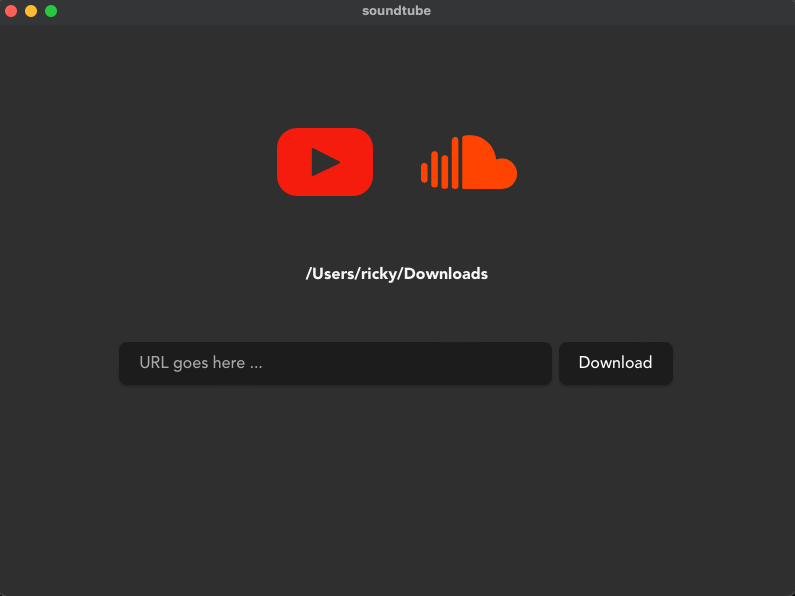

# Soundtube

This application is a simple interface to download musics and playlists from Youtube or Soundcloud with ease.

You fill the input with the link of the music or playlist and click on the download button. The application will download the music and save it in the folder you choose.



# Prerequisites

- [scdl](https://github.com/flyingrub/scdl) `pip3 install scdl`
- [yt-dpl](https://github.com/yt-dlp/yt-dlp) `brew install yt-dlp`
- [ffmpeg](https://ffmpeg.org/) `brew install ffmpeg`
- [ffprobe](https://ffmpeg.org/ffprobe.html) `brew install ffprobe`

# How to run in development mode

```bash
# Install deps
$ npm install

# Run the app
$ npm run tauri dev
```

# How to run the app

You can download the application for your distribution inside the releases page.

## Recommended IDE Setup

- [VS Code](https://code.visualstudio.com/) + [Tauri](https://marketplace.visualstudio.com/items?itemName=tauri-apps.tauri-vscode) + [rust-analyzer](https://marketplace.visualstudio.com/items?itemName=rust-lang.rust-analyzer)
